Plot with ggplot2
================
Yunyan Duan
6/3/2021

### Setup

Load packages.

``` r
rm(list = ls())

library(dplyr)
library(gamm4)
library(ggplot2)
library(gridExtra)
library(lme4)
library(purrr)
library(readr)
library(stringr)
library(tidyr)

## Helper functions ##
rotn <- function(x,n){rep(x,2)[n:(n+length(x)-1)]}

set.seed(312)
```

### Create toy data

Two-by-two Latin square design with subjects and items.

``` r
subj_list <- paste0("sub", seq(101,132))
item_list <- paste0("item", seq(1,24))

n_cond <- 4
latin_square_cond <- data.frame(sapply(seq(1:n_cond), rotn, x = 1:n_cond))
# latin square design matrix -> (+ items) -> versions -> (+ subjs) -> experiment 
df_exp <- latin_square_cond %>% 
  dplyr::slice(rep(1:n(), length(item_list) / n_cond)) %>%
  dplyr::mutate(item = item_list) %>%
  tidyr::gather(key = "version", value = "condition", -item) %>%
  dplyr::slice(rep(1:n(), length(subj_list) / n_cond)) %>%
  dplyr::mutate(subj = rep(subj_list, each = length(item_list)))

# # ... within-subj design
# df_exp <- tidyr::crossing(subj_list, item_list)

df_label <- data.frame(list(condition = 1:4,
                           cond = c("A1-B1", "A1-B2", "A2-B1", "A2-B2"),
                           factor_A = c("A1","A1","A2","A2"),
                           factor_B = c("B1","B2","B1","B2")
))
```

### General cases

Common plots.

``` r
df_g <- df_exp %>% 
  group_by(condition) %>%
  dplyr::mutate(RT = rnorm(n(), mean = rnorm(1, mean = condition, sd = 1), sd = 1),
                td = rnorm(n(), mean = mean(RT)),
                acc = 1*(runif(n()) > 0.5)
  ) %>%
  inner_join(df_label)
```

#### Comparison across conditions

A simple way to get some intuition about the data.

``` r
ggplot(df_g, aes(x = cond, y = RT)) +
  stat_summary(fun.data = "mean_cl_boot") +
  stat_summary(fun = "mean", geom = "text", 
               aes(label = round(..y.., 2)),
               hjust = 1.3) +
  xlab("Condition") +
  ylab("Reaction Time (ms)") +
  theme_bw()
```

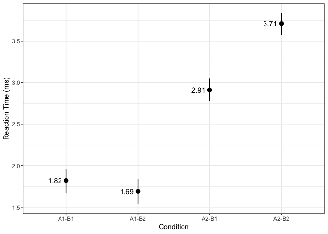<!-- -->

#### Basic 2-by-2 design plot

A simple way to check main effect and
interaction.

``` r
ggplot(df_g, aes(x = factor_A, y = RT, group = factor_B, color = factor_B)) +
  stat_summary(fun.data = "mean_cl_boot") +
  stat_summary(fun = "mean", geom = "line") +
  stat_summary(fun = "mean", geom = "text", aes(label = round(..y.., 2)),
               hjust = -0.5) +
  xlab("Factor A") +
  ylab("Reaction Time (ms)") +
  ggtitle("Line plot (basic)") +
  scale_color_discrete(name = "Factor B") +
  theme_bw() +
  theme(plot.title = element_text(hjust = 0.5))
```

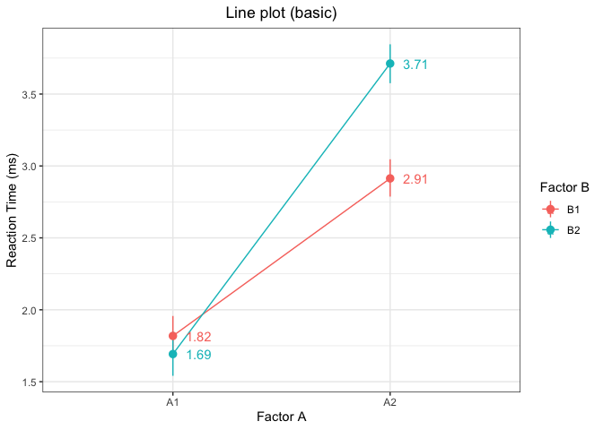<!-- -->

#### Fancy 2-by-2 design plot

… a customized version of the previous plot.

``` r
ggplot(df_g, aes(x = factor_A, y = RT, group = factor_B, 
                 color = factor_B, shape = factor_B, linetype = factor_B)) +
  stat_summary(fun.data = "mean_cl_boot", size = 0.8) +
  stat_summary(fun = "mean", geom = "line", size = 1) +
  stat_summary(fun = "mean", geom = "text", aes(label = round(..y.., 2)),
               hjust = -0.5, size = 4, fontface = "bold") +
  xlab("Factor A") +
  ylab("Reaction Time (ms)") +
  ggtitle("Line plot (customized)") +
  scale_color_manual(name = "Factor B", values = c("#FF7E83", "#75AADC")) +
  scale_shape_manual(name = "Factor B", values = c(2, 19)) +
  scale_linetype_manual(name = "Factor B", values = c("dashed", "solid")) +
  theme_bw() +
  theme(text = element_text(size = 14),
        plot.title = element_text(hjust = 0.5),
        legend.position = c(0.85, 0.2),
        legend.background = element_rect(colour = "grey60", 
                                         fill = "white", linetype = "solid"))
```

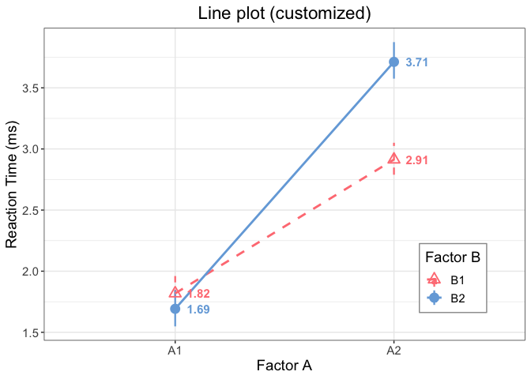<!-- -->

#### Bar plot

In case you prefer bar plot.

``` r
ggplot(df_g, aes(x = factor_A, y = RT, group = cond, fill = factor_B)) +
  stat_summary(fun = "mean", geom = "bar",
               width = 0.6,
               position = position_dodge(width = 0.6)) +
  stat_summary(fun.data = "mean_cl_boot", 
               position = position_dodge(width = 0.6),
               geom = "errorbar",
               width = 0.2) +
  xlab("Factor A") +
  ylab("Reaction Time (ms)") +
  ggtitle("Bar plot") +
  scale_fill_manual(name = "Factor B", 
                    values = c( "#FF7E83", "#75AADC")) +
  theme_bw() +
  theme(plot.title = element_text(hjust = 0.5))
```

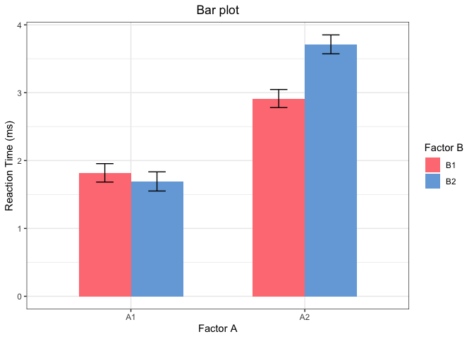<!-- -->

#### Box plot

In case you prefer box plot.

``` r
ggplot(df_g, aes(x = factor_A, y = RT, group = cond, 
                 color = factor_B, fill = factor_B)) +
  geom_boxplot(alpha = 0.5) +
  geom_point(position = position_dodge(width = 0.75), alpha = 0.2) +
  xlab("Factor A") +
  ylab("Reaction Time (ms)") +
  ggtitle("Boxplot") +
  scale_color_manual(name = "Factor B", 
                     values = c("#FF7E83", "#75AADC")) +
  scale_fill_manual(name = "Factor B", 
                    values = c("#FF7E83", "#75AADC")) +
  theme_bw() +
  theme(plot.title = element_text(hjust = 0.5))
```

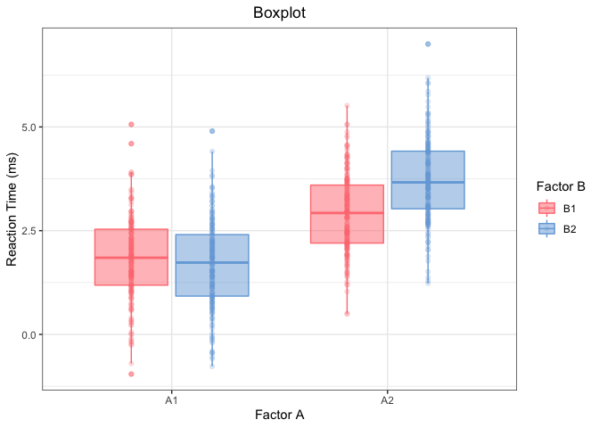<!-- -->

#### Violin plot

In case you prefer violin plot.

``` r
ggplot(df_g, aes(x = factor_A, y = RT, group = cond, 
                 color = factor_B, fill = factor_B)) +
  geom_violin(alpha = 0.5, draw_quantiles = c(0.25, 0.5, 0.75)) +
  geom_point(position = position_dodge(width = 0.9)) +
  xlab("Factor A") +
  ylab("Reaction Time (ms)") +
  ggtitle("Violin plot") +
  scale_color_manual(name = "Factor B", 
                     values = c( "#FF7E83", "#75AADC")) +
  scale_fill_manual(name = "Factor B", 
                    values = c( "#FF7E83", "#75AADC")) +
  theme_bw() +
  theme(plot.title = element_text(hjust = 0.5))
```

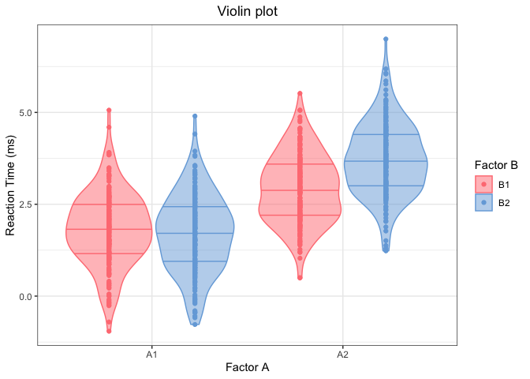<!-- -->

#### Linear mixed effect model (LMM)

Visualize LMM effects and check significance.

``` r
# fit lmm
contrasts(df_g$factor_A) <- contr.sum(2)
contrasts(df_g$factor_B) <- contr.sum(2)
m <- summary(lme4::lmer(data = df_g, 
                        RT ~ factor_A * factor_B + (1|subj) + (1|item),
                        REML = FALSE))
m$coefficients %>%
  data.frame() %>%
  tibble::rownames_to_column() %>%
  ggplot(aes(x = rowname, y = Estimate)) +
  geom_pointrange(aes(ymin = Estimate - 1.96*Std..Error, 
                      ymax = Estimate + 1.96*Std..Error),
                  fatten = 0.5) +
  geom_hline(yintercept = 0, linetype = "dashed") +
  coord_flip() +
  theme_bw()
```

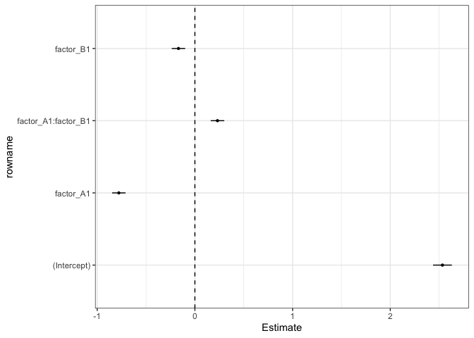<!-- -->

#### Correlation and linear regression

In case you have a continuous predictor or you want to check
correlation.

``` r
cc <- cor(df_g$td, df_g$RT)
ggplot(df_g, aes(x = td, y = RT)) +
  geom_point(alpha = 0.5) +
  geom_abline(size = 1) +
  geom_text(x = 0.9*max(df_g$td), y = mean(df_g$RT), 
            label = paste0("r = ", sprintf("%0.2f", round(cc, digits = 2))), 
            fontface = "italic", color = "red") +
  xlab("Whatever X") +
  ylab("Reaction Time (ms)") +
  ggtitle("Correlation/Regression") +
  theme_bw() +
  theme(plot.title = element_text(hjust = 0.5))
```

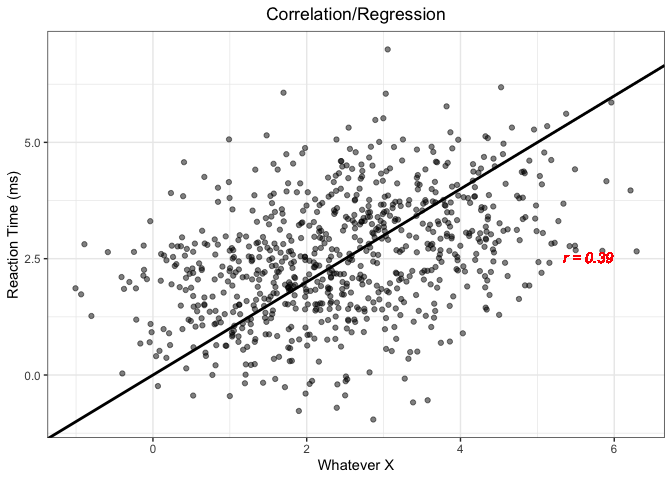<!-- -->

#### By-subj or by-item effect

Just play with functional programming.

``` r
df_g %>%
  split(.$item) %>%
  purrr::map(~ lm(RT ~ factor_A * factor_B, data = .)) %>%
  purrr::map(summary) %>%
  purrr::map(coef) %>%
  purrr::map(data.frame) %>%
  purrr::map(~ tibble::rownames_to_column(., var = "X")) %>%
  dplyr::bind_rows(.id = "item") %>%
  dplyr::filter(X != "(Intercept)") %>%
  dplyr::mutate(item_id = as.integer(stringr::str_extract(item, "\\d+"))) %>%
  ggplot(aes(x = item_id, y = Estimate)) +
  geom_pointrange(aes(ymin = Estimate - 1.96*Std..Error, 
                      ymax = Estimate + 1.96*Std..Error),
                  fatten = 0.5) +
  geom_hline(yintercept = 0, linetype = "dashed") +
  facet_wrap(~ X)
```

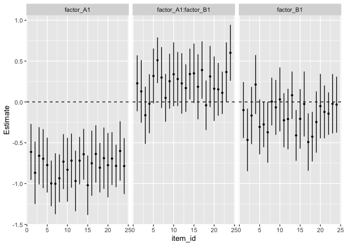<!-- -->

### Visual world paradigm data

In case you want to visualize data from an experiment using visual world
paradigm.

``` r
## add time windows ##
n_bin = 10
n_region = 3

da <- df_exp %>%
  dplyr::slice(rep(1:n(), n_bin)) %>%
  dplyr::mutate(bin_index = rep(1:n_bin, each = nrow(df_exp)))

da <- da %>%
  dplyr::mutate(`AVERAGE_IA_1_SAMPLE_COUNT_%` = runif(nrow(da), 0, 1),
                `AVERAGE_IA_2_SAMPLE_COUNT_%` = runif(nrow(da), 0, 1-`AVERAGE_IA_1_SAMPLE_COUNT_%`),
                `AVERAGE_IA_3_SAMPLE_COUNT_%` = 1 - `AVERAGE_IA_1_SAMPLE_COUNT_%` - `AVERAGE_IA_2_SAMPLE_COUNT_%`
  )

da_plot <- da %>%
  tidyr::gather(key = "IA", value = "pct", 
                `AVERAGE_IA_1_SAMPLE_COUNT_%`,
                `AVERAGE_IA_2_SAMPLE_COUNT_%`,
                `AVERAGE_IA_3_SAMPLE_COUNT_%`
  ) %>%
  dplyr::mutate(IA_ID = str_extract(IA, "\\d")) %>%
  dplyr::select(-IA)

## add label df ##
df_label_1 = data.frame(list(IA_ID = c("1", "2", "3"),
                             region = c("target", 
                                        "competitor",
                                        "distractor")
))

da_plot <- da_plot %>%
  inner_join(df_label_1) %>%
  inner_join(df_label)

da_plot <- da_plot %>%
  mutate(region = factor(region, 
                         levels = c("target", "competitor", "distractor")))

len_bin = 20
```

#### One condition

``` r
ggplot(da_plot %>% dplyr::filter(cond == "A2-B2"),
       aes(x = bin_index * len_bin, 
           y = pct, 
           fill = region, color = region,
           linetype = region, shape = region
       )) +
  stat_summary(fun.data = "mean_cl_boot", geom = "ribbon", 
               alpha = 0.3, colour = NA) +
  stat_summary(fun = "mean", geom = "line") +
  stat_summary(fun = "mean", geom = "point") +
  xlab("Time (ms)") +
  ylab("Total Proportion of Fixations") +
  ggtitle("A2-B2") +
  scale_x_continuous(breaks = seq(0, n_bin*len_bin, len_bin)) +
  theme_bw() +
  theme(plot.title = element_text(hjust = 0.5))
```

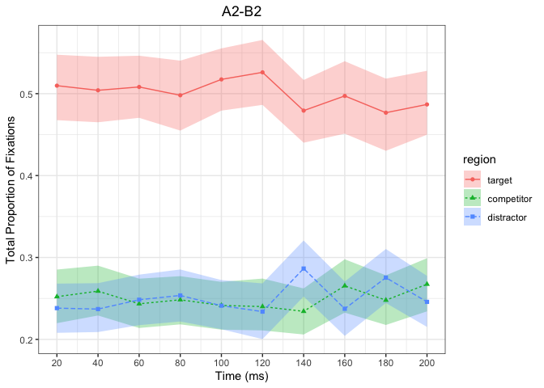<!-- -->

#### All conditions

``` r
ggplot(da_plot,
       aes(x = bin_index * len_bin, 
           y = pct, 
           fill = region, color = region,
           linetype = region, shape = region
       )) +
  stat_summary(fun.data = "mean_cl_boot", geom = 'ribbon', 
               alpha = 0.3, colour = NA) +
  stat_summary(fun = "mean", geom = "line") +
  stat_summary(fun = "mean", geom = "point") +
  xlab("Time (ms)") +
  ylab("Total Proportion of Fixations") +
  ggtitle("Title: visual world paradigm") +
  scale_x_continuous(breaks = seq(0, n_bin*len_bin, len_bin)) +
  facet_grid(factor_A ~ factor_B) +
  theme_bw() +
  theme(plot.title = element_text(hjust = 0.5))
```

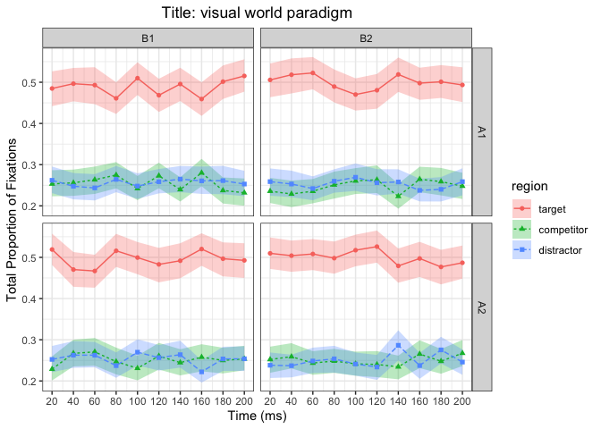<!-- -->

### Other plots

Plots that I ever plotted (once) :)

#### GAM & gridExtra::grid.arrange

Generalized additive models.

``` r
gam_ggplot <- function(gam0, sel, isprob = 1){
  gam.model <- plot.gam(gam0, select = 1)
  gam.data = data.frame(x = sapply(gam.model[sel], "[[", "x"),
                        fit_raw = sapply(gam.model[sel], "[[", "fit"),
                        se = sapply(gam.model[sel], "[[", "se"))
  
  intercept = gam0$coefficients[1]
  gam.data <- gam.data %>%
    mutate(fit_raw = fit_raw + intercept,
           raw_lo = fit_raw - se,
           raw_hi = fit_raw + se,
           fit_prop = exp(fit_raw)/(1 + exp(fit_raw)),
           prop_lo = exp(raw_lo)/(1 + exp(raw_lo)),
           prop_hi = exp(raw_hi)/(1 + exp(raw_hi))
    )
  
  if (isprob == 1){
    p <- ggplot(gam.data, aes(x = x, y = fit_prop,
                              color = "black", fill = "black")) +
      geom_line(size = 1)+
      geom_ribbon(aes(ymin = prop_lo, ymax = prop_hi), alpha = 0.3, color = NA)
  } else {
    p <- ggplot(gam.data, aes(x = x, y = fit_raw,
                              color = "black", fill = "black")) +
      geom_line(size = 1)+
      geom_ribbon(aes(ymin = raw_lo, ymax = raw_hi), alpha = 0.3, color = NA)
  }
  
  return(p)
}

plist <- df_g %>%
  dplyr::filter(item %in% c("item1","item2","item3")) %>%
  split(.$item) %>%
  purrr::map(~ bam(acc ~ s(RT), data = ., family = "binomial")) %>%
  purrr::map(gam_ggplot) %>%
  purrr::map(~ . + xlab("XXX") + ylab("YYY") +
               scale_color_manual(values = "#75AADC") +
               scale_fill_manual(values = "#75AADC") +
               theme_bw() + theme(legend.position = "none"))
```

``` r
plist <- purrr::map2(plist, names(plist), ~(.x + ggtitle(.y)))
do.call("grid.arrange", c(plist, ncol = 2))
```

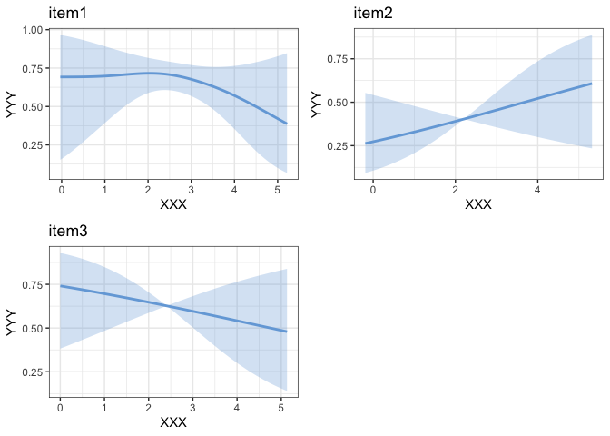<!-- -->

#### Dual y-axis

Dual y-axis in case you want to check speed-accuracy trade-off.

``` r
pct_scale = 8

n_fun <- function(x){
  return(data.frame(y = mean(x),
                    label = sprintf("%0.2f", round(mean(x), digits = 2))))
}
n_fun_pct <- function(x){
  return(data.frame(y = pct_scale*mean(x),
                    label = sprintf("%0.2f", round(mean(x), digits = 2))))
}

ggplot() +
  stat_summary(fun.data = "mean_cl_boot",
               mapping = aes(x = df_g$cond, y = pct_scale * df_g$acc),
               color = "blue") +
  stat_summary(fun.data = n_fun_pct,
               mapping = aes(x = df_g$cond, y = df_g$acc),
               geom = "text",
               color = "blue",
               position = position_dodge(width = 0.5), hjust = 1.2) +
  stat_summary(fun.data = "mean_cl_boot",
               mapping = aes(x = df_g$cond, y = df_g$RT),
               color = "red") +
  stat_summary(fun.data = n_fun,
               mapping = aes(x = df_g$cond, y = df_g$RT),
               geom = "text",
               color = "red",
               position = position_dodge(width = 0.5), hjust = 1.2) +
  scale_y_continuous(name = "Reaction Time (ms)",
                     sec.axis = sec_axis(~./pct_scale, name = "Accuracy")) +
  xlab("Condition") +
  scale_x_discrete(labels=c("A1-B1" = "a",
                            "A1-B2" = "b",
                            "A2-B1" = "c",
                            "A2-B2" = "d"
  )) +
  ggtitle("Speed vs. accuracy") +
  theme_bw() +
  theme(
    axis.title.y = element_text(color = "red"),
    axis.text.y = element_text(color = "red"),
    axis.title.y.right = element_text(color = "blue"),
    axis.text.y.right = element_text(color = "blue"),
    plot.title = element_text(hjust = 0.5)
  )
```

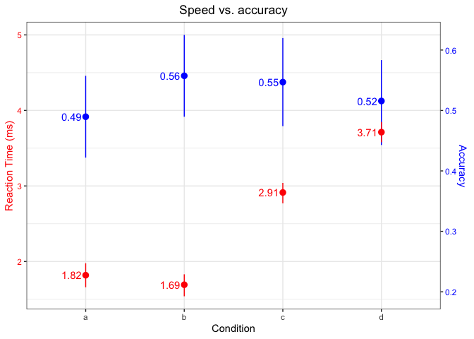<!-- -->

#### Non-alphabet characters

Mathematical expressions and Chinese characters.

``` r
ggplot(data=data.frame(x = 0, y = 0)) +
  geom_point(aes(x = x, y = y)) +
  xlab(expression(paste(Sigma, sigma, R^{2*c}, L[1~d]))) +
  ylab("纵坐标") +
  theme(axis.title.y = element_text(family="STFangsong"))
```

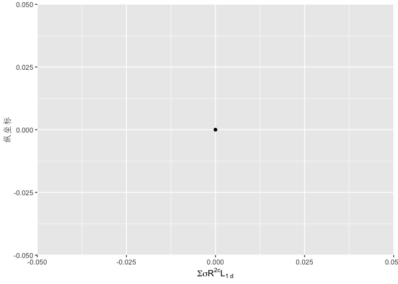<!-- -->
